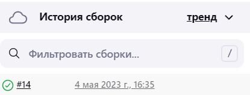

**Розрахунково-графічна робота**

**Стадник Г.О. 536ст**

**Автоматизація розгортки серверу для виконання скрипту мовою Python за допомогою Terraform та Jenkins**

**1. Підготовка GCP для автоматизації**

Спочатку створимо проект у GCP, у рамках якого будуть створюватися віртуальні машини і де буде проходити вся подальша автоматизація. 

Створення такого проекту ми розглядали в попередніх лабораторних роботах.Це не повинно викликати складнощів. Також ми повинні ввімкнути Compute Engine API щоб наші віртуальні машини працювали як потрібно. Створюємо service account для Terraform, що було також детально показано у попередніх роботах.

**2. Автоматизація створення віртуальної машини**

Ми вже докладно розглядали, як автоматизувати створення ВМ за допомогою Terraform, тому зараз ми не будемо розглядати кожну строчку .tf файлу, а просто розкажемо, який конфіг було обрано і обґрунтуємо свій вибір. Отже:

main.tf:

```
terraform {

`  `required\_providers {

`    `google = {

`      `source  = "hashicorp/google"

`      `version = "4.51.0"

`    `}

`  `}

}

provider "google" {

`  `credentials = file("mycode.json")

`  `project = "jenkins-385709"

`  `region  = "us-central1"

`  `zone    = "us-central1-c"

}

resource "google\_compute\_network" "vpc\_network" {

`  `name = "vpc-network"

`  `project = "jenkins-385709"

}

resource "google\_compute\_instance" "vm\_instance" {

`  `name         = "jenkins-1"

`  `machine\_type = "e2-standard-2" 

`  `tags         = ["code", "jenkins"]

`  `boot\_disk {

`    `initialize\_params {

`      `image = "ubuntu-os-cloud/ubuntu-minimal-2210-kinetic-amd64-v20230425"

`    `}

`  `}

`  `network\_interface {

`    `network = google\_compute\_network.vpc\_network.name

`    `access\_config {

`    `}

`  `}

}

resource "google\_compute\_firewall" "rules" {

`  `project       = "jenkins-385709"

`  `name          = "opensource"

`  `network       = google\_compute\_network.vpc\_network.name

`  `description   = "Creates firewall rule targeting tagged instances"

`  `source\_ranges = ["0.0.0.0/0"]

`  `allow {

`    `protocol = "tcp"

`    `ports    = ["20", "22", "80", "8080", "7777", "1000-2000"]

`  `}

`  `source\_tags = ["vpc"]

`  `target\_tags = ["firewall", "jenkins"]

}
```

variables.tf

```
variable "project" {

`  `default = "jenkins"

}

variable "credentials\_file" {

`  `default = "mycode.json"

}

variable "region" {

`  `default = "us-central1"

}

variable "zone" {

`  `default = "us-central1-c"

}

variable "machine\_name" {

`  `default = "jenkins"

}
```

У даних файлах ми створили ВМ мінімально можливої конфігурації в us-central1-c зоні. Операціною системою є ubuntu cloud. Стосовно останніх рядків: оскільки ми плануємо розгортати застосунок серверу, це значить, що треба вірно сконфігурувати вбудований у GCP брандмауер, щоб він дав доступ по SSH, потім доступ до Jenkins Це можна зробити шляхом налаштування ресурсу google\_compute\_firewall. Окрім того, оскільки ми створили ВМ із тегами, брандмауер був також налаштований на ці теги, щоб не впливати на потенційні інші віртуальні машини.

Тепер ми можемо не боятися блокування наших застосунків, що знаходяться на віртуальній машині. Створимо ВМ і мережі командою

```
terraform apply
```

Результат:

```
Apply complete! Resources: 2 added, 0 changed, 0 destroyed.

Outputs:

ip\_extra = " 35.188.187.90"

ip\_intra = " 10.128.0.2"
```

Машина була створена успішно.

**3. Налаштування середовища та Jenkins**

Зайдемо до ВМ по SSH і зробимо декілька речей. Спочатку, звісно, треба оновити базу даних менеджеру пакетів apt.

```
sudo apt update
```

Цей крок є опціональним, але для зручності можна поставити собі текстовий редактор nano

```
sudo apt install nano
```

Ті, хто знають, як покинути vim, можуть працювати з ним.

Обов'язково встановлюємо git

```
sudo apt install git
```

**3.1 Встановлення та налаштування Jenkins**

Перед тим, як встановити Jenkins, встановимо Java 11 версії.

```
sudo apt install openjdk-11-jre
```

Тепер встановимо сам Jenkins наступною послідовністю команд (згідно до офіційного мануалу)

```
curl -fsSL https://pkg.jenkins.io/debian/jenkins.io-2023.key | sudo tee \

`  `/usr/share/keyrings/jenkins-keyring.asc > /dev/null

echo deb [signed-by=/usr/share/keyrings/jenkins-keyring.asc] \

`  `https://pkg.jenkins.io/debian binary/ | sudo tee \

`  `/etc/apt/sources.list.d/jenkins.list > /dev/null

sudo apt-get update

sudo apt-get install jenkins
```


Далі треба перезавантажитись і Jenkins вже буде готовий до роботи. В консолі пишемо

sudo cat /var/lib/jenkins/secrets/initialAdminPassword

Копіюємо цей пароль. Він знадобиться для першої активації Jenkins. Перейдемо за External IP адресою і портом 8080. Відкриється вікно першого налаштування Jenkins. Вводимо отриманий раніше пароль. Встановлюємо рекомендуємі плагіни. Дуже рекомендується створити власний обліковий запис. Тоді матимемо змогу встановити свій пароль і взагалі працювати безпечно

Для того, щоб Jenkins міг виконувати дії від імені root, треба зробити наступне в самій ВМ:

```
cd /etc

sudo nano sudoers
```

Там після

```
\# User privilege specification

root    ALL=(ALL:ALL) ALL
```

Додаємо рядок

```
jenkins ALL=NOPASSWD: ALL
```

Це дозволить виконувати команди типу 'sh "sudo..."'

**3.2 Автоматизація CI/CD**

В Jenkins тиснемо "Create a Job" та обираємо Pipeline.

Додаємо опис і тиснемо "Це проект GitHub". Пишемо посилання на наш проект, в нашому випадку це був

```
<https://github.com/tarakan1ivan/jenkinsrepos>
```

Налаштовуємо наш паплайн щоб він автоматично брав наші файли с репозиторію та білділ їх у гілку main

Заздалегідь ми створили деякі файли для того щоб вивести те що нам необхідно,та налаштували наш паплайн під нас : 


Спробуємо запустити білд




Після очікування ми отримали успішну зборку,

1. **Перевірка працездатності**


**Висновки**

У цій РГР ми успішно використали всі знання, набуті протягом курсу, зокрема: ми використали Terraform для автоматизації розгортання ВМ та показали навички роботи з ним. Для автоматизації CI/CD ми скористалися знаннями, які мали про роботу з Jenkins. Для написання конфігураційних файлів для Terraform ми скористалися своїми знаннями про GCP. Крім того, ми використали Git, що є незамінним інструментом в будь-якому проекті.

В результаті ми розробили робочий та гнучкий пайплайн з мінімальною кількістю ручної роботи, яка полягала лише в підготовці ВМ для нормального запуску Jenkins та генерації ключів для Terraform. Після цієї невеликої ручної роботи, весь проект можна було змінити всього за кілька рядків конфігураційних файлів, якщо йшлося про ВМ, або зробити простий push, якщо ми змінювали безпосередньо сервер.
